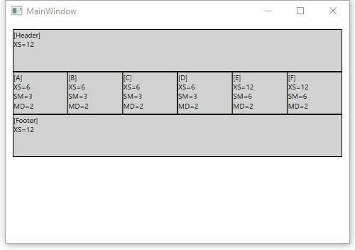
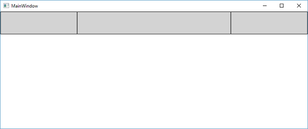
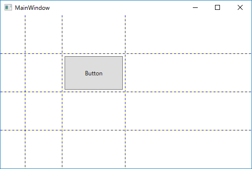
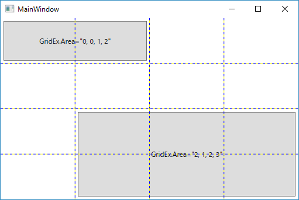
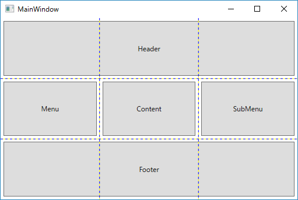
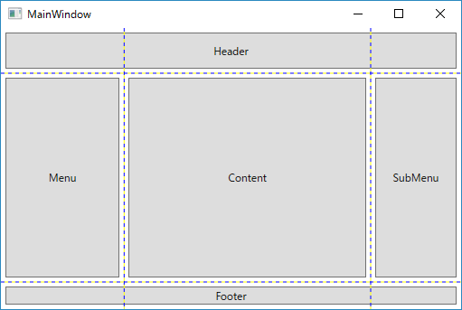

# GridExtra
GridExtra is a custom panel library for WPF/UWP.


* ResponsiveGrid
    * Custom Panel class that provides bootstrap like grid system.
    * Grid system
        * switch layout with window width.
            * XS(<768px), SM(<992px), MD(<1200px), LG(1200px<=)
        * 12 columns across the page.(customizable with MaxDivision property)
* GridEx
    * Helper class that defines usefull attached properties for Grid panel.

## install
*Nuget Package*  
```
Install-Package GridExtra
```
https://www.nuget.org/packages/GridExtra/

### Preparation
Add xmlns to xaml code.

#### For WPF
```xml
xmlns:ge="clr-namespace:SourceChord.GridExtra;assembly=GridExtra.Wpf"
```

#### For UWP
```xml
xmlns:ge="using:SourceChord.GridExtra"
```


## Usage
### ResponsiveGrid
ResponsiveGrid provides the grid layout system that is similar to Bootstrap framework.



#### Example
```xml
    <Grid>
        <Grid.Resources>
            <Style TargetType="{x:Type Border}">
                <Setter Property="BorderBrush" Value="Black" />
                <Setter Property="BorderThickness" Value="1" />
                <Setter Property="Background" Value="LightGray" />
                <Setter Property="Height" Value="60" />
            </Style>
        </Grid.Resources>
        <rg:ResponsiveGrid>
            <Border rg:ResponsiveGrid.XS="12" rg:ResponsiveGrid.SM="3" />
            <Border rg:ResponsiveGrid.XS="12" rg:ResponsiveGrid.SM="6" />
            <Border rg:ResponsiveGrid.XS="12" rg:ResponsiveGrid.SM="3" />
        </rg:ResponsiveGrid>
    </Grid>
```
*extra small device(~768px)*  


*small device(~992px)*  


#### Properties

##### Dependency Properties
|Property Name|Type|Description|
|-----|-----|-----|
|MaxDivision|int|Gets or sets a value that determines grid divisions.|
|BreakPoints|BreakPoints class||
|ShowGridLines|int|Gets or sets a value that indicates whether grid column's lines are visible within this ResponsiveGrid. |


##### Attached Properties

|Property Name|Type|Description|
|-----|-----|-----|
|XS<br/>SM<br/>MD<br/>LG<br/>|int|Gets or sets a value that determines grid columns for XS(extra small), SM(small), MD(medium), LG(large) devices.|
|XS_Offset<br/>SM_Offset<br/>MD_Offset<br/>LG_Offset<br/>|int|Gets or sets a value that determines grid columns offset for XS(extra small), SM(small), MD(medium), LG(large) devices.|
|XS_Push<br/>SM_Push<br/>MD_Push<br/>LG_Push<br/>|int|Gets or sets a value that moves columns to right from the original position.|
|XS_Pull<br/>SM_Pull<br/>MD_Pull<br/>LG_Pull<br/>|int|Gets or sets a value that moves columns to left from the original position.|


##### Compared to bootstrap

|bootstrap|ResponsiveGrid|
|-----|-----|
|col-xs<br/>col-sm<br/>col-md<br/>col-lg<br/>|XS<br/>SM<br/>MD<br/>LG<br/>|
|col-xs-offset<br/>col-sm-offset<br/>col-md-offset<br/>col-lg-offset<br/>|XS_Offset<br/>SM_Offset<br/>MD_Offset<br/>LG_Offset<br/>|
|col-xs-push<br/>col-sm-push<br/>col-md-push<br/>col-lg-push<br/>|XS_Push<br/>SM_Push<br/>MD_Push<br/>LG_Push<br/>|
|col-xs-pull<br/>col-sm-pull<br/>col-md-pull<br/>col-lg-pull<br/>|XS_Pull<br/>SM_Pull<br/>MD_Pull<br/>LG_Pull<br/>|
|visibility-xs, visibility-sm,…<br />hidden-xs, hidden-sm,...|(T.B.D.)|


#### attention
ResponsiveGrid is not suitable for ItemsPanel, because it isn't implemented VirtualizingPanel class.

If you use ResponsiveGrid in ListBox as ItemsPanel.
Your ListBox become to not virtualize items of ListBox.


### GridEx
GridEx is Helper class for defining Grid properties.

#### Example1 (Row/Column Definition)
```xml
    <Grid ge:GridEx.RowDefinition="*, *, *, *"
          ge:GridEx.ColumnDefinition="50, 75, *, 2*"
          ShowGridLines="True">
        <Button Grid.Row="1"
                Grid.Column="2"
                Margin="5"
                Content="Button" />
    </Grid>
```



#### Example2 (Area Definition)
`Area` property provides the way of defineing Row/Column/RowSpan/ColumnSpan.

```xml
    <Grid ge:GridEx.RowDefinition="*, *, *, *"
          ge:GridEx.ColumnDefinition="*, *, *, *"
          ShowGridLines="True">
        <Button Margin="5"
                ge:GridEx.Area="0, 0, 1, 2"
                Content="GridEx.Area=&quot;0, 0, 1, 2&quot;" />
        <Button Margin="5"
                ge:GridEx.Area="2, 1, 2, 3"
                Content="GridEx.Area=&quot;2, 1, 2, 3&quot;" />
    </Grid>
```




#### Example3 (Named Template Area)

`TemplateArea` provides named grid areas, like CSS Grid Layout Module Level 1.  
`TemplateArea` property makes row/column definition. And, define region's name.

Children of Grid can be placed with region's name, that is defined by `TemplateArea` property.


```xml
    <Grid ge:GridEx.TemplateArea="
            Header Header Header &#10;
            Menu Content SubMenu &#10;
            Footer Footer Footer &#10;
          "
          ShowGridLines="True">
        <Button Margin="5"
                ge:GridEx.AreaName="Header"
                Content="Header" />
        <Button Margin="5"
                ge:GridEx.AreaName="Menu"
                Content="Menu" />
        <Button Margin="5"
                ge:GridEx.AreaName="Content"
                Content="Content" />
        <Button Margin="5"
                ge:GridEx.AreaName="SubMenu"
                Content="SubMenu" />
        <Button Margin="5"
                ge:GridEx.AreaName="Footer"
                Content="Footer" />
    </Grid>
```




Row devision is defined by line feed or `/`.
* line feed
    * `\n`(.cs)
    * `&#10;`(xaml)
* `/`

```xml
    <Grid ge:GridEx.TemplateArea="
            Header Header Header/
            Menu Content SubMenu/
            Footer Footer Footer/
          ">
```


#### Example4 (Named Template Area, working with RowDefinition/ColumnDefintion)

```xml
    <Grid ge:GridEx.RowDefinition="50, *, 30"
          ge:GridEx.ColumnDefinition="*, 2*, 100"
          ge:GridEx.TemplateArea="
            Header Header Header/
            Menu Content SubMenu/
            Footer Footer Footer/
          "
          ShowGridLines="True">
        <Button Margin="5"
                ge:GridEx.AreaName="Header"
                Content="Header" />
        <Button Margin="5"
                ge:GridEx.AreaName="Menu"
                Content="Menu" />
        <Button Margin="5"
                ge:GridEx.AreaName="Content"
                Content="Content" />
        <Button Margin="5"
                ge:GridEx.AreaName="SubMenu"
                Content="SubMenu" />
        <Button Margin="5"
                ge:GridEx.AreaName="Footer"
                Content="Footer" />
    </Grid>
```




##### Attached Properties(for Grid)

|Property Name|Type|Description|
|-----|-----|-----|
|RowDefinition|string|Sets a value that determines row definition of Grid.|
|ColumnDefinition|string|Sets a value that determines column definition of Grid.|
|TemplateArea|string|Sets a definition of grid devision and area names. |

##### Attached Properties(for Grid children)

|Property Name|Type|Description|
|-----|-----|-----|
|Area|string|Sets a value that determines Row, Column, RowSpan, ColumnSpan properties.|
|AreaName|string|Sets a name of regions for item's belong.(use with `TemplateArea` property)|

## Lisence
[MIT](LICENSE)
